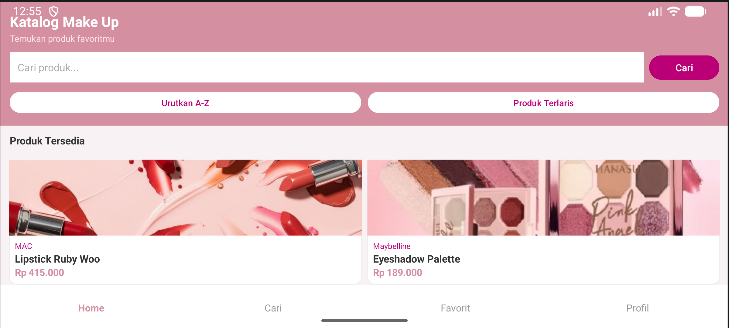
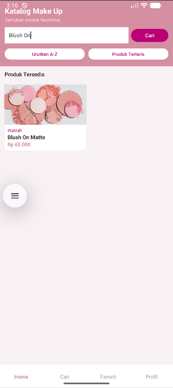
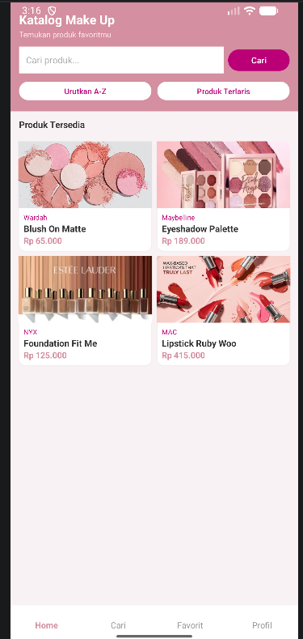
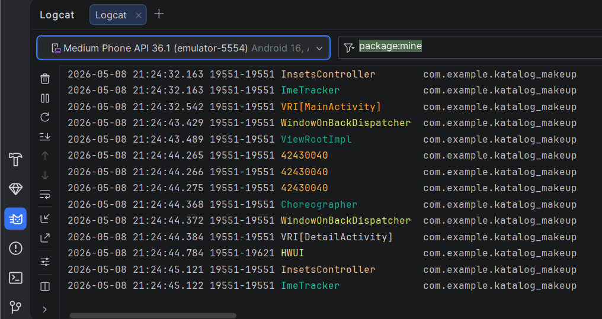

# Katalog Make Up 

## 1. Identitas Mahasiswa
 **Nama Lengkap** :  Salsabila Nur Shafa 
 **NIM** : 42430040 
 **Mata Kuliah** : Pemrograman Seluler 

## 2. Topik Aplikasi

**Katalog Make Up Wanita**

Aplikasi Android yang menampilkan katalog produk make up wanita. Pengguna dapat melihat daftar produk, mencari produk berdasarkan nama, mengurutkan produk secara alfabetis, serta melihat detail lengkap setiap produk.

## 3. Screenshot Aplikasi

### Tampilan Portrait
> *(Tambahkan screenshot portrait di sini)*

### Tampilan Landscape
> *(Tambahkan screenshot landscape di sini)*

## 4. Screenshot Hasil Pencarian dan Pengurutan Data

### Hasil Pencarian (Linear Search)
> *(Tambahkan screenshot hasil pencarian di sini)*

### Hasil Pengurutan A-Z (Bubble Sort)
> *(Tambahkan screenshot hasil pengurutan di sini)*

## 5. Screenshot Logcat

### Jendela Logcat dengan NIM 42430040
> *(Tambahkan screenshot logcat yang menampilkan NIM 42430040 di sini)*

---

## 6. Fitur Aplikasi

- **Katalog Produk** — Menampilkan produk make up dalam grid 2 kolom
- **Detail Produk** — Menampilkan informasi lengkap saat kartu diklik (Intent)
- **Pencarian (Linear Search)** — Mencari produk berdasarkan nama
- **Urutkan A-Z (Bubble Sort)** — Mengurutkan produk dari A sampai Z
- **Produk Terlaris** — Menampilkan produk berdasarkan urutan terlaris
- **Validasi Input** — Memastikan kolom pencarian tidak kosong
- **Error Handling (Try-Catch)** — Menangani error di setiap aksi
- **Logcat** — Merekam aktivitas aplikasi dengan Tag NIM 42430040

---

## 7. Produk yang Tersedia

| No | Nama Produk | Brand | Harga | Kategori |
|---|---|---|---|---|
| 1 | Lipstick Ruby Woo | MAC | Rp 415.000 | Bibir |
| 2 | Eyeshadow Palette | Maybelline | Rp 189.000 | Mata |
| 3 | Foundation Fit Me | NYX | Rp 125.000 | Wajah |
| 4 | Blush On Matte | Wardah | Rp 65.000 | Pipi |

---

## 8. Milestone Pengerjaan

| Minggu | Tugas | Status |
|---|---|---|
| Minggu 1 | UI Layout Portrait & Landscape | ✅ Selesai |
| Minggu 2 | Navigasi Intent & Validasi Input | ✅ Selesai |
| Minggu 3 | Array, Linear Search, Bubble Sort | ✅ Selesai |
| Minggu 4 | Try-Catch, Logcat, README | ✅ Selesai |
