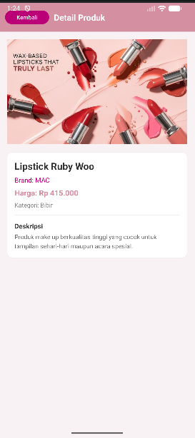
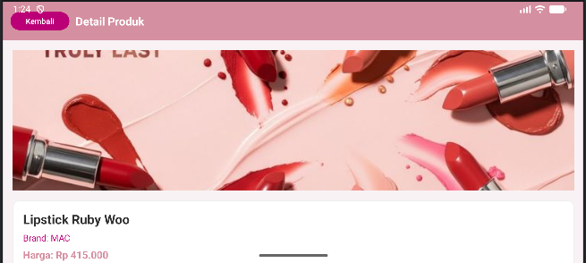

# UAS Pemrograman Seluler - Aplikasi Katalog Make Up Wanita

---

## Identitas Mahasiswa

- **Nama Lengkap:** Salsabila Nur Shafa
- **NIM:** 42430040
- **Program Studi:** Teknologi Informasi

---

## Deskripsi Aplikasi

Aplikasi ini dibangun untuk memenuhi Ujian Akhir Semester (UAS) mata kuliah Pemrograman Seluler. Aplikasi ini mendemonstrasikan penguasaan materi per minggu, meliputi:

1. **Modul 2 & 3: Desain UI/UX** dan penerapan Layout Responsif yang beradaptasi saat Portrait dan Landscape.

2. **Modul 4 & 5: Navigasi multi-layar dan Validasi Input** menggunakan `Intent` untuk mengirim data produk ke halaman detail, serta validasi kolom pencarian agar tidak kosong.

3. **Modul 6: Implementasi Array dan Pencarian Data** menggunakan:
   - Array untuk menyimpan data produk make up
   - Algoritma **Linear Search** untuk mencari produk berdasarkan nama

4. **Modul 7: Pengurutan Data** menggunakan algoritma **Bubble Sort** untuk menampilkan produk secara A-Z dan fitur Produk Terlaris.

5. **Modul 9: Error Handling** menggunakan `try-catch` untuk menangani error dan **Logcat** dengan NIM `42430040` sebagai Tag untuk merekam aktivitas aplikasi.

---

## Screenshot Aplikasi

### 1. Halaman Utama (Responsif)

| Mode Portrait | Mode Landscape |
|:---:|:---:|
|  |  |

---

### 2. Halaman Detail Produk

| Mode Portrait | Mode Landscape |
|:---:|:---:|
|  |  |

---

### 3. Screenshot Hasil Pencarian dan Pengurutan Data

| Hasil Pencarian (Linear Search) | Hasil Pengurutan A-Z (Bubble Sort) |
|:---:|:---:|
|  |  |

---

### 4. Screenshot Jendela Logcat

> Logcat menampilkan aktivitas aplikasi dengan Tag NIM **42430040**

| Logcat |
|:---:|
|  |

---

## Produk yang Tersedia

| No | Nama Produk | Brand | Harga | Kategori |
|:---:|---|---|---|---|
| 1 | Lipstick Ruby Woo | MAC | Rp 415.000 | Bibir |
| 2 | Eyeshadow Palette | Maybelline | Rp 189.000 | Mata |
| 3 | Foundation Fit Me | NYX | Rp 125.000 | Wajah |
| 4 | Blush On Matte | Wardah | Rp 65.000 | Pipi |

---

## Milestone Pengerjaan

| Minggu | Tugas | Status |
|:---:|---|:---:|
| Minggu 1 | UI Layout Portrait & Landscape | ✅ Selesai |
| Minggu 2 | Navigasi Intent & Validasi Input | ✅ Selesai |
| Minggu 3 | Array, Linear Search, Bubble Sort | ✅ Selesai |
| Minggu 4 | Try-Catch, Logcat, README | ✅ Selesai |
